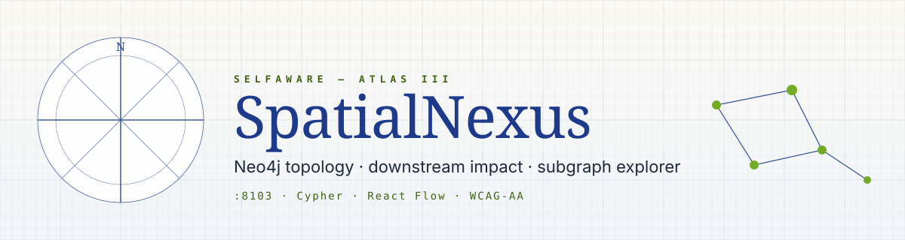

<p align="center">
  
</p>

# SpatialNexus · Topology Atlas

> **GraphRAG / topology** — **`POST /v1/impact`** and **`GET /v1/graph/subgraph`** run **Cypher** on **Neo4j** and return **nodes** and **edges** (no stub graph: Neo4j must be configured). The **web** app includes a **React Flow** graph explorer (`@xyflow/react`) fed by the same payload.

| Spec | Value |
|---|---|
| **Theme** | Atlas Blueprint — cobalt + sage on ivory, DM Serif Display + IBM Plex Mono |
| **Port** | `:8103` |
| **Stack** | FastAPI · Neo4j 5 · Vite · React 19 · @xyflow/react · Tailwind 4 |

### Quick links
[API.md](docs/API.md) · [ARCHITECTURE.md](docs/ARCHITECTURE.md) · [PLAN.md](docs/PLAN.md) · [TESTING.md](docs/TESTING.md) · [UI.md](docs/UI.md) · [CHANGELOG.md](docs/CHANGELOG.md) · [SCREENSHOTS.md](docs/SCREENSHOTS.md) · [Suite — Ports & URLs](../docs/PORTS_AND_URLS.md)

### Open these to test

| What | Localhost | LAN |
|---|---|---|
| Swagger | http://127.0.0.1:8103/docs | http://&lt;LAN_IP&gt;:8103/docs |
| Health | http://127.0.0.1:8103/health | http://&lt;LAN_IP&gt;:8103/health |
| Subgraph | http://127.0.0.1:8103/v1/graph/subgraph?seed=PUMP-A1&depth=2 | http://&lt;LAN_IP&gt;:8103/v1/graph/subgraph?seed=PUMP-A1&depth=2 |
| Neo4j Browser | http://127.0.0.1:7474 | http://&lt;LAN_IP&gt;:7474 |
| UI | http://localhost:5173 | http://&lt;LAN_IP&gt;:5173 |


| | |
|--|--|
| **GitHub** | [Kimosabey/spatial-nexus](https://github.com/Kimosabey/spatial-nexus) |
| **Clone** | `git clone git@github.com:Kimosabey/spatial-nexus.git` |
| **Default API port** | `8103` |
| **Stack** | FastAPI · **neo4j** driver 5.x · **web:** Vite · React 19 · TypeScript · Tailwind 4 · TanStack Query · RHF · Zod · **@xyflow/react** · Framer Motion · Sonner · Lucide |
| **Roadmap** | [docs/PLAN.md](docs/PLAN.md) |
| **UI / UX** | [docs/UI.md](docs/UI.md) |
| **DB & DBeaver (suite)** | [../docs/DATABASE_AND_DBEAVER.md](../docs/DATABASE_AND_DBEAVER.md) |

---

## Neo4j (Docker / DBeaver / Browser)

Compose exposes **Bolt `127.0.0.1:7687`** and **HTTP Browser `http://127.0.0.1:7474`**. Default user `neo4j`, password `spatialdevpassword` (see `docker-compose.yml` / `.env.example`).

- **DBeaver:** New connection → Neo4j → URL `bolt://127.0.0.1:7687`.
- **Seed demo:** [`scripts/seed.cypher`](scripts/seed.cypher) (e.g. asset id `PUMP-A1`).

Full port matrix and clash notes: [DATABASE_AND_DBEAVER.md](../docs/DATABASE_AND_DBEAVER.md).

---

## Repository layout

```
spatial-nexus/
├── app/main.py              # POST /v1/impact (Neo4j required; no stub graph)
├── web/
│   ├── src/
│   │   ├── pages/ImpactPage.tsx
│   │   └── components/ImpactGraphFlow.tsx
│   └── README.md
├── docs/
├── Dockerfile
├── docker-compose.yml
├── requirements.txt
├── .env.example
└── README.md
```

---

## Features

### API

| Method | Path | Description |
|--------|------|-------------|
| `GET` | `/health` | Liveness |
| `POST` | `/v1/impact` | Body: `{ "asset_id": string, "horizon_hours": number }` (1–720). Response: `request_id`, `asset_id`, `horizon_hours`, `nodes[]` (`id`, `label`, `kind`), `edges[]` (`source`, `target`, `relation`), `narrative`, `source` (`"neo4j"` \| `"stub"`) |

**Neo4j path:** requires `NEO4J_URI` and `NEO4J_PASSWORD` (and optionally `NEO4J_USER`). Queries match nodes/relationships around the given asset id/name. Any driver/query error falls back to **stub** behaviour.

### Web UI

- **Impact query** form: asset id + horizon.
- **Summary** cards: node list, edge list, neo4j vs stub badge.
- **Graph explorer** — pan, zoom, minimap, draggable nodes.
- OpenAPI link in header.

---

## Environment variables

| Variable | Description |
|----------|-------------|
| `PORT` | Default `8103` |
| `NEO4J_URI` | Bolt / neo4j URI |
| `NEO4J_USER` | Default `neo4j` |
| `NEO4J_PASSWORD` | Required for live graph reads |
| `CORS_ORIGINS` | Comma-separated allowed origins |

**Web:** `VITE_API_BASE` — optional ([web/README.md](web/README.md)).

See [.env.example](.env.example).

---

## Run locally

**API:** run from the **repository root** (folder that contains `app/`). Not from inside `app/`.

**Windows:** `.\run-dev.ps1` or `run-dev.bat`.

```bash
python -m venv .venv && .venv\Scripts\activate
pip install -r requirements.txt
python -m uvicorn app.main:app --reload --host 0.0.0.0 --port 8103
```

**Web:**

```bash
cd web && npm install && npm run dev
```

Dev proxy targets **8103**.

---

## Docker

```bash
docker compose up --build
```

Combined SPA + API on **8103**.

---

## `web/` scripts

| Command | Purpose |
|---------|---------|
| `npm run dev` | Dev server |
| `npm run build` | `tsc -b` + Vite production build |
| `npm run preview` | Preview |
| `npm run lint` | ESLint |

---

## Schema notes

The bundled Cypher assumes nodes may expose `id`, `name`, or `asset_id` properties compatible with your graph model; adjust `app/main.py` queries to match your labels and property keys.

---

## License

Proprietary — Graylinx / SelfAware® unless otherwise stated.
