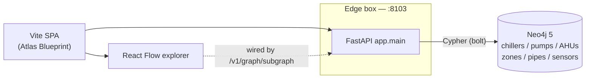
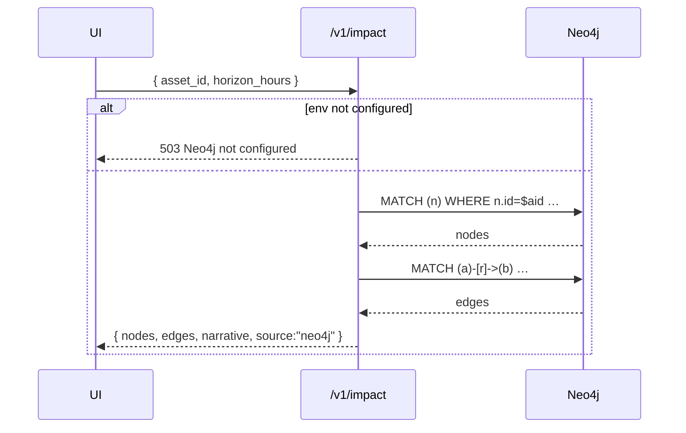

# SpatialNexus — architecture

## Component diagram



## Impact-query flow



## Subgraph-explorer flow

```mermaid
sequenceDiagram
  participant UI
  participant API as /v1/graph/subgraph
  participant N as Neo4j

  UI->>API: ?seed=PUMP-A1&depth=2&limit=80
  API->>API: clamp depth∈[1,4], limit∈[1,500]
  API->>N: MATCH p=(seed)-[*1..d]-(n) … relationships(p), nodes(p)
  N-->>API: rows
  API->>API: dedupe nodes by id; collect edges
  API-->>UI: { nodes, edges, seed, depth }
```

## Ontology (seed)

`scripts/seed.cypher` plants a minimal HVAC ontology so the demo asset
`PUMP-A1` returns useful nodes + edges. Production graphs use the same shape
(`Asset`, `Zone`, `Sensor` labels; `FEEDS`, `SERVES`, `LOCATED_IN` relations).

## Frontend

- **Atlas Blueprint** theme: cobalt + sage on ivory, DM Serif Display headlines,
  IBM Plex Mono IDs, dual-scale blueprint grid background, rotating compass-rose
  watermark, isometric node motif in the hero.
- React Flow renders the explorer with a radial layout from the seed.
- WCAG: skip-link, reduced-motion, semantic landmarks, focus rings.
